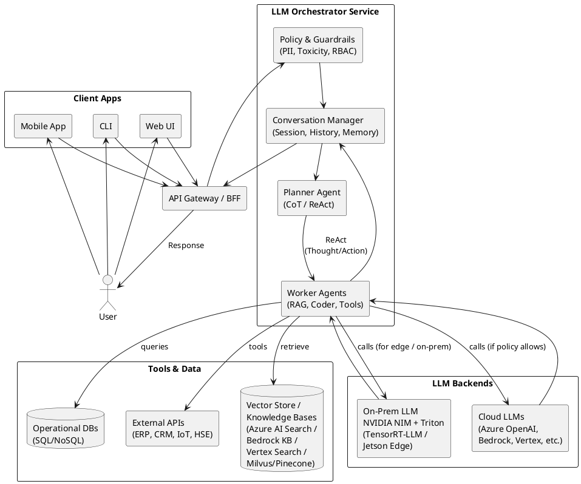

# Architecture Diagram (PlantUML)
Generic architecture combining: RAG + ReAct + Multi-Agent + Guardrails, with the option to run LLM on NIM/Triton (on-premises/Jetson) or in the cloud.

You can reuse this diagram as a "standard template" for AMVA/Colsubsidio/oil company proposals, simply replacing the logos and cloud elements.