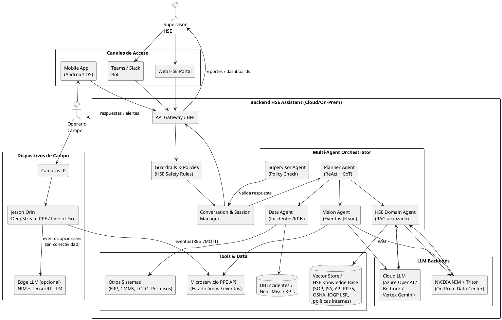

# Use case: HSE technical assistant for “prevention of workplace accidents in oil fields”

This assistant leverages LLMs + RAG + multi-agent reasoning + Jetson-based computer vision to proactively prevent accidents, support field operations, and strengthen safety culture across drilling, workover, production, and maintenance environments.

## 1. Core Capabilities
### 1.1. Field Operator / Supervisor Safety Assistant

The assistant answers high-risk, time-sensitive questions such as:

* “Can I perform hot work in this location if there is a high-pressure gas line nearby?”
* “Provide the full step-by-step Lockout/Tagout (LOTO) procedure for Pump B-14.”
* “Summarize the applicable IOGP Life-Saving Rules for working at height and line of fire before starting this task.”

The assistant retrieves authoritative sources including:

* Standard Operating Procedures (SOPs)
* Job Safety Analyses (JSAs)
* Risk matrices
* Permit-to-Work requirements
* API RP 75 / SEMS requirements
* OSHA Oil & Gas Hazards
* IOGP Life-Saving Rules
* Internal corporate HSE policies

Then it produces:

* Actionable step-by-step guidance
* Risk factors and critical controls
* Mandatory PPE for the task
* Citations to documents, sections, and safety standards

Real-world frameworks referenced

* IOGP Life-Saving Rules — https://www.iogp.org
* OSHA Oil & Gas — https://www.osha.gov/oil-and-gas
* API RP 75 (SEMS) — https://www.api.org

--- 

### 1.2. Proactive Prevention Using Computer Vision (Jetson Orin + DeepStream)

On-site cameras connected to NVIDIA Jetson Orin and DeepStream perform:

**PPE Detection**  

* Helmet
* High-visibility vest
* Safety glasses
* Gloves
* Fire-retardant clothing (FR)
* Face shields

**Line-of-Fire Detection**  

Detects workers entering hazardous zones such as:

* Suspended loads
* Rotating equipment
* Heavy vehicle movement
* Drill floor red zones
* Snubbing and hydraulic workover danger zones

**Automated Response**

When a violation is detected:

* Immediate warning to the field operator via radio or mobile app
* Automatic near-miss logging
* Real-time recommendations, e.g.:

    **_“Exit the line of fire immediately. This condition violates Life-Saving Rule 7. Recommended actions: …”_**

Supporting literature

**PPE detection on Jetson:**
* SpringerLink – https://link.springer.com
* Edge Impulse – https://docs.edgeimpulse.com
* DeepStream examples – https://developer.nvidia.com/deepstream-sdk

--- 

### 1.3. Incident and Near-Miss Analysis

The user submits:

* Free-text incident description
* Images or videos processed by CV
* Location, equipment, and operation details

The assistant:

* Extracts preliminary root causes
* Identifies contributing factors
* Detects procedural or permit violations
* Maps violated IOGP Life-Saving Rules
* Suggests corrective and preventive actions (CAPA)
* Aligns recommendations to OSHA, API RP 75, IOGP, and internal HSE guidelines

Useful references

* OSHA Incident Investigation Guide — https://www.osha.gov
* API RP 75 (Risk-based SEMS) — https://www.api.org
* IOGP Safety Data — https://www.iogp.org

## 2. LLM Design Patterns Applied to Oilfield HSE
### 2.1. Advanced RAG for Safety-Critical Domains

**Internal sources indexed:**

* HSE Manuals
* Standard Operating Procedures (SOPs)
* Permit-to-Work (PTW) policies
* Lockout/Tagout (LOTO) procedures
* Job Safety Analyses (JSA)
* Risk assessment matrices
* Historical incident/near-miss reports
* Audits and non-conformance logs
* Internal adaptations of:
    * OSHA
    * API RP 75 (SEMS)
    * IOGP Life-Saving Rules
    * UNECE terminal safety
    * Asset-specific hazard controls

**Advanced RAG Capabilities**

* HSE Semantic Chunking: Organizes procedures into: Purpose → Scope → PPE → Steps → Hazards → Controls → PTW.
* Query Rewriting:
    Enhances operator questions:
    * “Can I do hot work here?” becomes:
    * “hot work + gas line + confined space + required gas testing + IOGP LSR alignment”.

* Reranking: Critical safety documents and life-saving rules always outrank general manuals.
* Strict Grounding:
    Each recommendation cites:
    * Document
    * Section
    * Revision
    * Standard

---

### 2.2. ReAct Pattern + Tool Calling

**Typical tools integrated**

* `search_sop(query, asset_id, task)`
* `get_ppe_status(area_id) from Jetson/DeepStream`
* `log_near_miss(event) into corporate HSE system`
* `get_incident_stats(hazard_type, timeframe)`
* `get_wind_speed(site) for work at height and helidecks`

**ReAct Example**

**_Thought:_** “I must ensure PPE compliance before giving instructions.”
**_Action:_** get_ppe_status(area_id="PAD-12")
**_Observation:_** “1 worker without helmet, 2 without safety glasses.”
**_Thought:_** “This violates LSR 2 (PPE) and increases risk of eye injury.”
**_Final Answer:_** Safety instruction + Stop Work recommendation + CAPA.

---

### 2.3. Multi-Agent Architecture (Orchestrator–Worker–Supervisor)

**Suggested agents**

* Planner Agent: interprets operator request and designs workflow.
* HSE Domain Agent: interprets OSHA/API/IOGP and ensures compliance.
* Data Agent: manages KPIs, incident history, hazard trends.
* Vision Agent: consumes DeepStream outputs and summarizes violations.
* Supervisor Agent: final reviewer enforcing compliance with:
    * API RP 75
    * OSHA
    * IOGP LSR
    * Corporate Safety Policies

This follows the model used by Microsoft AutoGen, LangGraph, and Anthropic agentic architectures.

---

### 2.4. HSE Guardrails and Enterprise Safety Controls

**Hard safety rules**

* If uncertain:
    **_“I cannot confirm this is safe. Stop work and contact your HSE supervisor immediately.”_**

* Forbidden:
    * Contradicting OSHA / API RP 75 / IOGP
    * Downplaying risk
    * Making production-driven decisions over safety
    * Giving advice outside domain (medical, legal, HR)
* PII filtering for incident reports
* High-risk instructions require source citations

**Guardrails enforced using:**

* Azure AI Content Safety
* AWS Bedrock Guardrails
* Custom validation logic

## 3. Specific architecture (PlantUML)
### 3.1. Diagram


## 4. Code examples by stack

Note: These are skeletons, designed for you to complete with your favorite libraries (LangGraph/LangChain, FastAPI, NestJS, etc.).

### 4.1. Python – HSE Orchestrator (RAG + ReAct simplified)
```python
from typing import List, Dict
from datetime import datetime

# --- Tools (a implementar con tus sistemas) ---

def search_sop(query: str, operation_type: str, asset_id: str) -> List[Dict]:
    # Busca en el vector store / Azure AI Search / Elastic / etc.
    # Retorna lista de {title, section, content, source}
    ...

def get_ppe_status(area_id: str) -> Dict:
    # Llama a microservicio que expone eventos de Jetson / DeepStream
    # { "area_id": "...", "last_5_min": {...}, "violations": [...] }
    ...

def log_near_miss(event: Dict) -> None:
    # Inserta en DB corporativa de incidentes / near-miss
    ...

# --- LLM wrapper (Azure / Bedrock / Vertex / NIM) ---

def call_llm(messages: List[Dict]) -> str:
    # Un solo punto para cambiar de proveedor
    ...

# --- Orquestador ReAct muy simplificado ---

def hse_assistant(query: str, user_role: str, area_id: str, asset_id: str):
    # 1. Paso RAG: SOP + normas
    sops = search_sop(query=query, operation_type="hot_work", asset_id=asset_id)

    # 2. Paso visión: estado PPE actual
    ppe_state = get_ppe_status(area_id)

    # 3. Construir prompt con grounding HSE
    context_sops = "\n\n".join(
        f"[{i+1}] {d['title']} - {d['section']}\n{d['content']}"
        for i, d in enumerate(sops)
    )
    context_ppe = f"PPE Violations (last 5 min) in {area_id}: {ppe_state.get('violations', [])}"

    system_msg = {
        "role": "system",
        "content": (
            "Eres un asistente HSE para campos petroleros. "
            "DEBES priorizar la seguridad sobre la producción. "
            "Si hay alguna duda sobre la seguridad, indica detener el trabajo y "
            "consultar al supervisor HSE. Usa SOLO la información del contexto."
        )
    }

    user_msg = {
        "role": "user",
        "content": f"Pregunta: {query}\n\nContexto SOP:\n{context_sops}\n\nContexto PPE:\n{context_ppe}"
    }

    answer = call_llm([system_msg, user_msg])

    # 4. Opcional: si detectas near-miss por violaciones, registra
    if ppe_state.get("violations"):
        log_near_miss({
            "timestamp": datetime.utcnow().isoformat(),
            "area_id": area_id,
            "query": query,
            "ppe_state": ppe_state,
            "llm_answer_excerpt": answer[:500],
        })

    return answer

```

--- 

### 4.2. Azure OpenAI + Azure AI Search – RAG HSE

Assume you already have an Azure AI Search index with HSE documents.

```python
from azure.search.documents import SearchClient
from azure.core.credentials import AzureKeyCredential
from openai import OpenAI
import os

search_client = SearchClient(
    endpoint=os.environ["AZURE_SEARCH_ENDPOINT"],
    index_name=os.environ["HSE_INDEX_NAME"],
    credential=AzureKeyCredential(os.environ["AZURE_SEARCH_KEY"])
)

llm_client = OpenAI(
    api_key=os.environ["AZURE_OPENAI_KEY"],
    base_url=os.environ["AZURE_OPENAI_ENDPOINT"]
)

DEPLOYMENT = os.environ["AZURE_OPENAI_DEPLOYMENT"]

def rag_hse_azure(question: str):
    results = search_client.search(
        search_text=question,
        top=5,
        query_type="semantic",
        semantic_configuration_name="hse-semantic-config"
    )

    docs = []
    for r in results:
        docs.append(f"{r['title']} ({r['section']}): {r['content']}")

    context = "\n\n".join(docs)

    prompt = f"""
Eres un asistente HSE para campos petroleros.

Responde SOLO usando este contexto, y cita el título/sección de donde tomas la información:

{context}

Pregunta: {question}
"""

    resp = llm_client.responses.create(
        model=DEPLOYMENT,
        input=prompt
    )
    return resp.output[0].content[0].text

```

---

### 4.3. AWS Bedrock – Agent + HSE Knowledge Base

Here, we assume you have already defined the following in the console:

* A Knowledge Base with HSE documentation.
* An Agent that uses it.

```python
import boto3, os

client = boto3.client("bedrock-agent-runtime", region_name="us-east-1")
AGENT_ID = os.environ["BEDROCK_HSE_AGENT_ID"]
ALIAS_ID = os.environ["BEDROCK_HSE_AGENT_ALIAS_ID"]

def ask_hse_agent(question: str, session_id: str):
    resp = client.invoke_agent(
        agentId=AGENT_ID,
        agentAliasId=ALIAS_ID,
        sessionId=session_id,
        inputText=question,
    )

    chunks = []
    for event in resp["completion"]:
        if "chunk" in event:
            chunks.append(event["chunk"]["bytes"].decode("utf-8"))
    return "".join(chunks)

```
Bedrock Agent handles RAG, tool calling, and guardrails if you configure them.

---

### 4.4. GCP Vertex AI/Gemini – HSE incident summary

```python
import vertexai
from vertexai.generative_models import GenerativeModel

vertexai.init(project="tu-proyecto", location="us-central1")
gemini = GenerativeModel("gemini-2.0-flash-exp")

def summarize_incident_hse(raw_report: str, standards_snippet: str) -> str:
    prompt = f"""
Eres un experto HSE en campos petroleros.

Tienes el siguiente reporte de incidente/near-miss:

{raw_report}

Y este extracto de normas y procedimientos de la compañía (basados en OSHA y API RP 75):

{standards_snippet}

1. Resume el incidente.
2. Identifica causas probables y factores contribuyentes.
3. Relaciona qué Life-Saving Rules se aplican.
4. Propón acciones correctivas y preventivas.

Responde en formato numerado y claro.
"""
    resp = gemini.generate_content(prompt)
    return resp.text

```

---

### 4.5. Node.js / TypeScript – HSE Microservice on Jetson PPE API

```python
import express from "express";
import axios from "axios";

const app = express();
app.use(express.json());

const JETSON_PPE_API = process.env.JETSON_PPE_API || "http://jetson-orin:8080/ppe-status";

app.post("/hse/check-hot-work", async (req, res) => {
  const { areaId, question } = req.body;

  // 1. Llamar a PPE API del Jetson
  const ppeResp = await axios.get(`${JETSON_PPE_API}?area=${areaId}`);
  const ppeState = ppeResp.data; // { violations: [...], last5min: ... }

  // 2. Construir prompt y llamar tu LLM backend (Azure, Bedrock, NIMs, etc.)
  const prompt = `
Eres un asesor HSE.

Pregunta: ${question}
Área: ${areaId}
Estado PPE (últimos 5 minutos): ${JSON.stringify(ppeState)}

Si hay violaciones, debes recomendar detener el trabajo y avisar al supervisor HSE.
`;

  const llmResp = await axios.post("http://llm-orchestrator/hse-chat", { prompt });

  res.json({
    ppeState,
    answer: llmResp.data.answer,
  });
});

app.listen(3000, () => {
  console.log("HSE service listening on port 3000");
});

```

---

### 4.6. NVIDIA Jetson + DeepStream + Triton/NIM – PPE Event Transmitter

Python pseudocode for Jetson to send PPE events to the cloud:

```python
import time, json, requests
from ppe_inference import get_ppe_events  # tu wrapper DeepStream/GStreamer

BACKEND_URL = "https://hse-backend.company.com/ppe-events"
AREA_ID = "PAD-12"

def main():
    while True:
        events = get_ppe_events()
        if events:
            payload = {
                "area_id": AREA_ID,
                "timestamp": time.time(),
                "events": events,
            }
            try:
                requests.post(BACKEND_URL, json=payload, timeout=2)
            except Exception:
                # Si no hay conectividad, log local / store-and-forward
                pass
        time.sleep(5)

if __name__ == "__main__":
    main()

```

---

## 5. Repository structure for the HSE assistant (Oilfield Safety Copilot)

Designed as a single repository: edge (Jetson), backend LLM/agents, cloud infrastructure, and documentation for sale/production.

```text
oilfield-hse-assistant/
├─ README.md
├─ LICENSE
├─ .gitignore
├─ docs/
│  ├─ 00-executive-brief/
│  │  ├─ executive-summary.md
│  │  └─ value-proposition-hse.md
│  ├─ 01-architecture/
│  │  ├─ logical-architecture.md
│  │  ├─ plantuml/
│  │  │  ├─ hse-assistant-architecture.puml
│  │  │  └─ hse-assistant-sequence-flows.puml
│  │  └─ data-flow-and-security.md
│  ├─ 02-hse-domain/
│  │  ├─ standards-osha-api-iogp.md
│  │  ├─ glossary-hse-oilgas.md
│  │  └─ prompt-guardrails-hse.md
│  ├─ 03-deployment-guides/
│  │  ├─ azure-deployment.md
│  │  ├─ aws-bedrock-deployment.md
│  │  ├─ gcp-vertex-deployment.md
│  │  └─ onprem-nvidia-nims-triton.md
│  └─ 04-poc-material/
│     ├─ proposal-template.md
│     ├─ kpi-metrics-hse.md
│     └─ training-plan-supervisors.md
│
├─ backend/
│  ├─ hse-assistant-api/
│  │  ├─ app/
│  │  │  ├─ main.py               # FastAPI/Flask
│  │  │  ├─ routers/
│  │  │  │  ├─ chat_hse.py
│  │  │  │  ├─ incidents.py
│  │  │  │  └─ health.py
│  │  │  ├─ services/
│  │  │  │  ├─ rag_service.py
│  │  │  │  ├─ ppe_service_client.py
│  │  │  │  ├─ incidents_service.py
│  │  │  │  └─ guardrails_service.py
│  │  │  ├─ agents/
│  │  │  │  ├─ planner_agent.py
│  │  │  │  ├─ hse_domain_agent.py
│  │  │  │  ├─ data_agent.py
│  │  │  │  ├─ vision_agent.py
│  │  │  │  └─ supervisor_agent.py
│  │  │  ├─ llm_clients/
│  │  │  │  ├─ azure_openai_client.py
│  │  │  │  ├─ aws_bedrock_client.py
│  │  │  │  ├─ gcp_vertex_client.py
│  │  │  │  └─ nvidia_nim_client.py
│  │  │  ├─ models/               # Pydantic / DTOs
│  │  │  ├─ config.py
│  │  │  └─ logging_config.py
│  │  ├─ tests/
│  │  ├─ requirements.txt / pyproject.toml
│  │  └─ Dockerfile
│  │
│  ├─ ppe-events-api/
│  │  ├─ app/
│  │  │  ├─ main.py                # API que recibe eventos Jetson
│  │  │  ├─ routers/
│  │  │  │  └─ ppe_events.py
│  │  │  ├─ services/
│  │  │  │  ├─ store_events.py
│  │  │  │  └─ aggregations.py
│  │  │  ├─ models/
│  │  │  └─ config.py
│  │  ├─ tests/
│  │  └─ Dockerfile
│  │
│  ├─ frontends/
│  │  ├─ web-hse-portal/          # React/Next.js
│  │  └─ mobile-app/              # Expo/React Native o Flutter
│  └─ scripts/
│     └─ load_hse_kb_to_vectorstore.py
│
├─ edge/
│  ├─ jetson-deepstream/
│  │  ├─ apps/
│  │  │  ├─ ppe_detection_app/
│  │  │  │  ├─ main.cpp / main.py   # GStreamer/DeepStream pipeline
│  │  │  │  ├─ configs/
│  │  │  │  │  ├─ pgie_ppe_config.txt
│  │  │  │  │  └─ source_cameras.yaml
│  │  │  │  └─ models/
│  │  │  │     ├─ ppe_detector.engine
│  │  │  │     └─ labels.txt
│  │  ├─ docker/
│  │  │  ├─ Dockerfile.deepstream
│  │  │  └─ docker-compose.yml
│  │  └─ scripts/
│  │     └─ send_ppe_events.py      # envía a backend/ppe-events-api
│  │
│  ├─ jetson-nims-triton/
│  │  ├─ models/                   # repositorio Triton (model repo)
│  │  │  └─ llm/
│  │  │     ├─ config.pbtxt
│  │  │     └─ model.plan / onnx
│  │  ├─ docker/
│  │  │  ├─ Dockerfile.triton
│  │  │  └─ compose-triton.yml
│  │  ├─ client-examples/
│  │  │  └─ call_llm_from_jetson.py
│  │  └─ configs/
│  │     └─ triton-server-config.yaml
│  │
│  └─ monitoring/
│     └─ tegrastats_prometheus_exporter/
│
├─ ml/
│  ├─ cv-models/
│  │  ├─ notebooks/
│  │  │  └─ train_ppe_detector.ipynb
│  │  ├─ datasets/
│  │  ├─ training-configs/
│  │  └─ export_to_tensorrt.md
│  ├─ llm-prompts/
│  │  ├─ system-prompts/
│  │  │  ├─ hse_assistant_system.md
│  │  │  └─ supervisor_policy_system.md
│  │  ├─ tools-schema/
│  │  │  ├─ search_sop.json
│  │  │  ├─ get_ppe_status.json
│  │  │  └─ log_near_miss.json
│  │  └─ examples/
│  │     └─ fewshot_hse_examples.md
│  └─ evaluation/
│     ├─ hse_eval_dataset.jsonl
│     └─ eval_scripts.py
│
├─ infra/
│  ├─ terraform/
│  │  ├─ azure/
│  │  │  ├─ main.tf
│  │  │  ├─ modules/
│  │  │  └─ variables.tf
│  │  ├─ aws/
│  │  └─ gcp/
│  ├─ kubernetes/
│  │  ├─ base/
│  │  │  ├─ hse-assistant-api-deployment.yaml
│  │  │  ├─ ppe-events-api-deployment.yaml
│  │  │  ├─ ingress.yaml
│  │  │  └─ configmaps-secrets.yaml
│  │  └─ overlays/
│  │     ├─ dev/
│  │     ├─ qa/
│  │     └─ prod/
│  └─ ci-cd/
│     ├─ github-actions/
│     │  ├─ backend-ci.yml
│     │  ├─ edge-build.yml
│     │  └─ infra-deploy.yml
│     └─ azure-devops/ (si aplica)
│
└─ .devcontainer/ (opcional si usas VS Code)
   └─ devcontainer.json
```